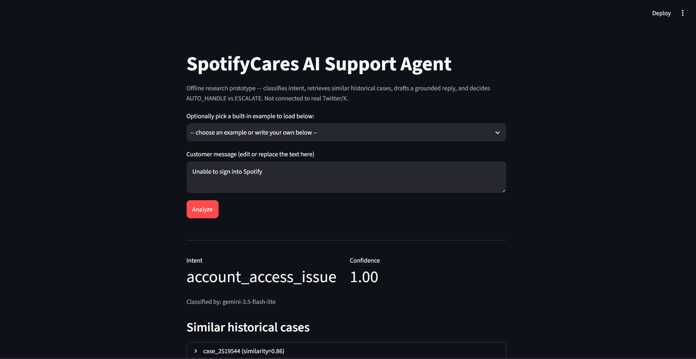
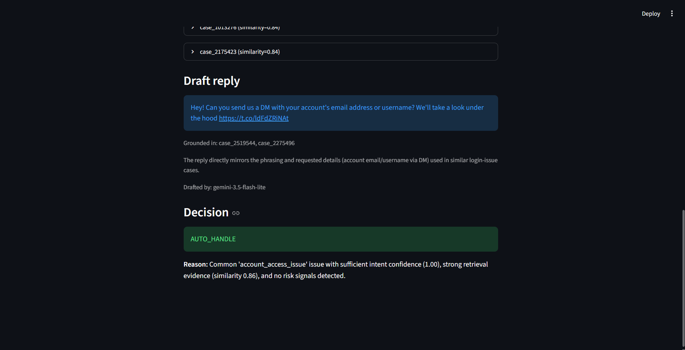

# Hiver SDE Intern — Brand-Specific AI Customer Support Agent

An AI prototype that reads a Spotify customer support message, figures
out what kind of problem it is, looks up how similar real complaints
were handled before, drafts a reply grounded in that history, and
decides whether it's confident enough to send that reply on its own —
or whether a human should look at it first.

It's built with **retrieval, not training**: historical support
conversations are searched and read at reply-time (like a search engine
feeding an AI writer), never used to train a new model from scratch.
Escalating to a human is treated as a *safety feature*, not a failure —
most of this project's effort went into rigorously measuring how well
that call gets made, including a self-audit that finds and explains a
real safety gap rather than hiding it behind one good-looking number.

## Results at a glance

| Metric | Result |
|---|---:|
| Intent classification accuracy | **84.7%** (vs. 12.2% naive baseline) |
| Retrieval quality (similarity to best historical match) | **0.86** avg |
| Reply groundedness (LLM-judged, 1-5) | **4.90 / 5** |
| **Escalation accuracy — the number that actually matters** | **60.3%** |

**The honest headline:** classifying the *type* of problem works well
(84.7%), but knowing *when it's safe to auto-answer* is a harder,
different problem the system is right about only 60.3% of the time. Out
of 100 messages a human would say should be escalated, this system
currently hands off only about 35 correctly. That gap was found,
root-caused, and deliberately left unpatched rather than tuned against
the same examples used to catch it — full reasoning in
[`docs/misleading_headline_number.md`](docs/misleading_headline_number.md).

## Run it

Needs Python 3.10+.

```bash
python -m venv .venv
.venv\Scripts\activate        # Windows
source .venv/bin/activate     # macOS/Linux

pip install -r requirements.txt
cp .env.example .env          # then add your own LLM_API_KEY (free at aistudio.google.com/apikey)
```

**Tests** — fully self-contained, no data or API key needed:

```bash
pytest
```

**Command line and visual demo** — need one more one-time setup step
first: the search index over historical support cases is too large to
commit to the repo, so build it once:

```bash
python -m scripts.build_index   # needs data/processed/support_cases.jsonl — see the walkthrough doc if you don't have it
```

Then:

```bash
python -m src.agent "My music keeps stopping every few seconds"
python -m src.agent                # no message -> interactive loop
streamlit run app/streamlit_app.py # or the visual version
```

<p align="center">
  
</p>
<p align="center">
  
</p>

If `data/processed/` is empty, the raw dataset hasn't been downloaded yet
on this machine — see
[`docs/full_technical_walkthrough.md`](docs/full_technical_walkthrough.md#data-preparation)
for that one-time setup. **You don't need any of this just to read the
results** — the evaluation set, all metrics, and the write-ups below are
already computed and committed.

## Project layout

```
src/            classifier, retriever, reply generator, escalation logic, the agent
baselines/      simple comparison models (majority-class, TF-IDF)
evaluation/     scoring harness, LLM-as-judge, human-agreement analysis
app/            Streamlit demo
scripts/        one-off pipeline steps (build the index, run evaluations, ...)
tests/          pytest suite (86 tests, all offline)
data/, artifacts/   evaluation set, saved metrics, predictions, plots
docs/           methodology write-ups, failure analysis, full technical walkthrough
```

## Want the full depth?

This README is the short version. For the complete phase-by-phase
walkthrough (every pipeline stage, exact commands, full results, and how
to rebuild everything from the raw dataset), see
[`docs/full_technical_walkthrough.md`](docs/full_technical_walkthrough.md).

For *why* each non-obvious engineering decision was made, see
[`DECISION_LOG.md`](DECISION_LOG.md) (48 entries, indexed).

**Status:** Phases 0-18 of a 20-phase plan are complete (full pipeline,
evaluation, self-critique, demo, plus a reliability hardening pass added
after). The final report and a from-scratch reproducibility check are
the two remaining items — see the walkthrough doc's Roadmap section.
